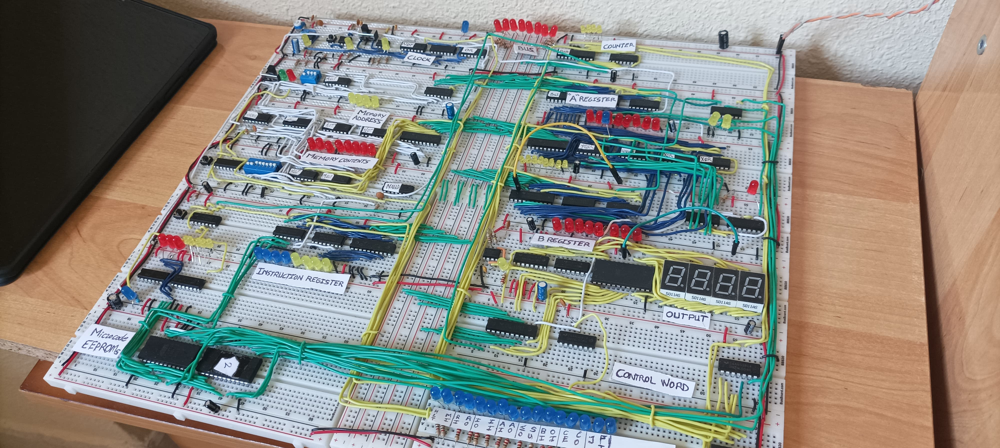
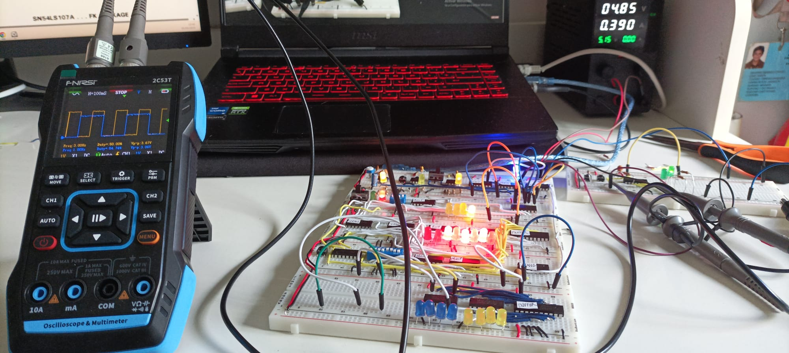
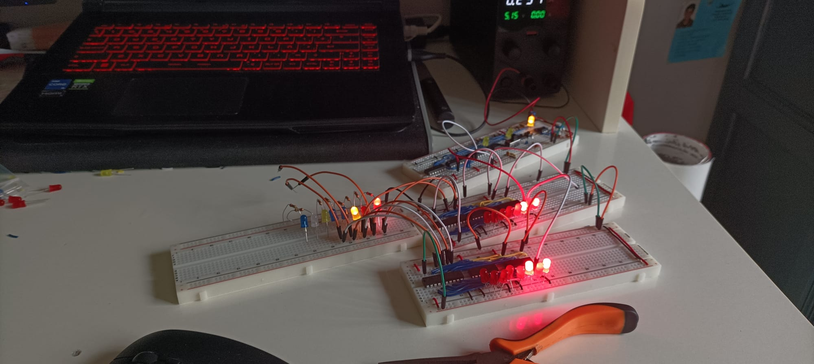
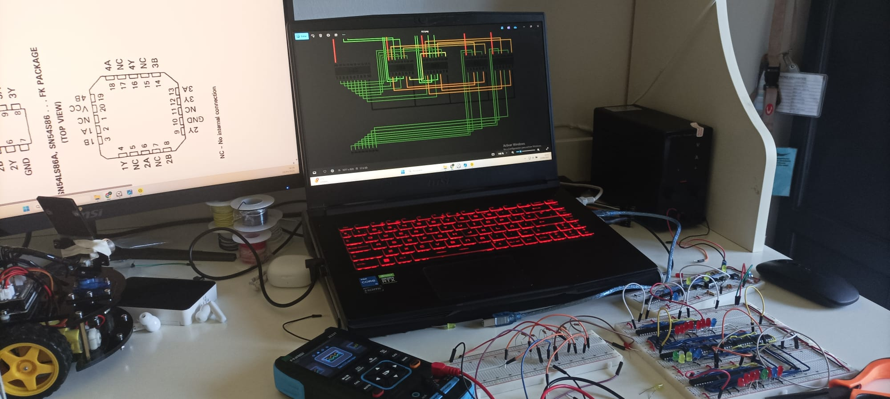
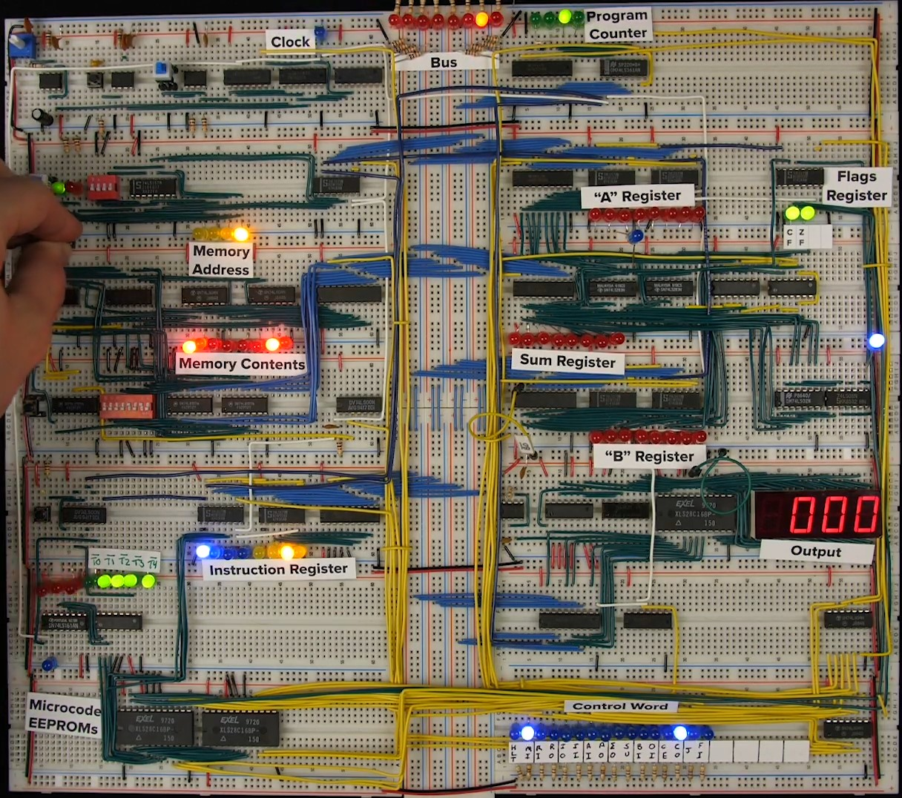
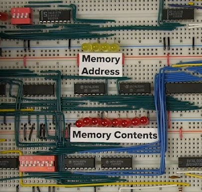

# 🧠 8-bit CPU from Scratch
**Inspired by Ben Eater’s 8-bit computer, built from the ground up with curiosity, mistakes, and learning along the way.**

---

## 📋 Table of Contents

1. [💡 Motivation](#💡-motivation)  
2. [🔨 Project Phases](#🔨-project-phases)  
3. [🐞 Errors & Decisions](#🐞-errors--decisions)  
4. [🧩 Technical Chapters](#🧩-technical-chapters)  
5. [🎓 What I Learned](#🎓-what-i-learned)  
6. [▶️ How to Use / Run It](#▶️-how-to-use--run-it)

---

## 💡 Motivation

I wanted to take on a challenging project that would push me to truly learn electronics, not just in theory, but by getting hands-on with real components. At the same time, I was curious to deeply understand one of the most fundamental processes behind everything we interact with daily: low-level computer processing.

Even though we don’t deal with it directly, every app, video, or piece of software we use relies on that invisible layer of computation happening behind the scenes. Gaining a real grasp of how that works was my goal.

During my search, I came across a well-known figure on the internet: **Ben Eater**. His step-by-step videos on how to build an 8-bit computer from scratch were the perfect starting point. I decided to follow his guidance, replicate the machine, and document my process, not just to copy it, but to truly understand, modify, and build upon it.

---

## 🔨 Project Phases

1. **Design and planning**  
2. **Physical construction (breadboard setup)**  
3. **EEPROM programming**  
4. **Microcode development**  
5. **Custom instruction implementation**  
6. **Debugging and iteration**

---

## 🐞 Errors & Decisions

I ran into a lot of errors during this project. Honestly, way more than I would’ve liked. A lot. And when I say a lot, I mean a lot.

One of the biggest challenges was dealing with voltage spikes, those sudden jumps that happen when pressing buttons or switching RAM chips. I also had issues with the power supply voltage. All of the chips I used are TTL logic, which are supposed to work at a specific voltage range. But at higher voltages, spikes become more frequent, and they can completely throw off the logic, making the circuit behave unexpectedly.

To deal with this, I had to add lots of capacitors to smooth out signals and reduce noise. I also used RC filters to stabilize things.

There were also programming issues with the EEPROM, accidental component damage, bad wiring, and pretty much every kind of mistake you can think of.

But here’s the thing: none of that really matters, what matters is that every mistake taught me something, and eventually, I was able to fix it. That’s what this project is about.

---

## 🧩 Technical Chapters (Some photos)

### 1️⃣ RAM

This image shows the RAM module during testing. I had to deal with noisy signals and used RC filters and capacitors to stabilize it. This was one of the most sensitive parts due to voltage spikes and data instability.

---

### 2️⃣ REGISTER

This image reflects part of the register.

---

### 3️⃣ ALU

This is the ALU (Arithmetic Logic Unit) section. It was critical for operations like addition, subtraction, and logical comparisons. Here I learned a lot about binary arithmetic and how to combine logic gates for operations.

---

## 🎓 What I Learned

🔌 Reverse polarity matters.
I learned that reverse polarity can destroy components, either by damaging internal transistors, diodes, or by allowing current to flow in the wrong direction. In this particular build, I didn’t implement protection for it, but it’s definitely something to consider in future designs.

⚡ How TTL logic works.
I now understand the precise voltage thresholds that define a 0 or a 1 in TTL logic. I also learned why TTL was eventually replaced by CMOS, which is far more power-efficient. At peak load, my computer was drawing up to 1.5A , though that’s partly because of all the LEDs I added.

📖 Datasheets are your best friend.
I learned to study datasheets carefully and thoroughly. They’re not just optional, they’re your final authority. You can honestly learn a ton just by reading Texas Instruments datasheets in depth.

🧰 The value of RC filters and decoupling capacitors.
Voltage spikes can cause false signals and unstable logic. I saw firsthand how RC filters and capacitors can smooth out those glitches and help keep the circuit stable.

🧠 Low-level computer architecture.
I gained a solid understanding of how a computer works at the lowest level: fetching an instruction from memory, decoding it, activating the appropriate control lines, and finally performing the operation to produce a result.

## 🎥 Demo Video Summary
You can watch a 3-part video demo of the project on LinkedIn.

Here’s a brief summary of each part:

🧠 Part 1 – Human CPU Mode
In the first clip, the CPU wasn’t fully built yet , so I acted as the CPU myself. I manually toggled the control lines: first loading a 1 into Register A, then a 1 into Register B, and finally triggering the sum via the ALU. Then I inverted the ALU signal to perform a subtraction instead of an addition (2 -).

⚙️ Part 2 – Programmed Addition
The second video shows the CPU performing an addition fully on its own, programmed via the EEPROM. Register A loads the value 28, Register B gets 41, and the result 69 is shown. Everything happens at a slow clock speed so you can clearly see the operation step-by-step.

💻 Part 3 – It Becomes a Real Computer
In the final video, the system reaches a key milestone: it becomes Turing Complete. As defined by the father of computer science, a machine is considered a computer when it supports conditional jumps , and that’s exactly what’s shown here.

The program sums +15 repeatedly. Once an overflow occurs and the max value is reached, a conditional jump is triggered and the system switches to subtraction mode, all based on the program logic.

## Into The Rabbit Hole

I'm going to try my best to explain how a computer works. It’s mostly logic and a bunch of 0s and 1s, but my goal is that after reading this, you'll at least get the gist of it. It’s not that hard, but it can definitely get confusing.

To keep things simple, I’m including an image of Ben Eater’s computer, it’s much cleaner and easier to follow than mine. The image is just there to help you build a mental picture and follow along as you read. You don’t need to understand the circuits themselves, in fact, it’s probably best if you just focus on the labeled parts and don’t get too caught up in the rest.

The explanation you're about to read is just an introduction, it doesn’t dive deep into the technical stuff, but if you read it a couple of times, you'll get the general idea. In fact, you’ll probably be able to explain it to someone else afterwards.

As Lex Fridman says, that’s actually one of the best ways to make things stick.

Imagine the computer as a factory,  with workers (the registers), a conveyor belt (the bus), and a boss who gives out instructions from the EEPROM. The clock (CLK) sets the pace, ticking like a metronome so that every part of the system moves in perfect sync. The instructions, like a daily to-do list, are stored in RAM, and the boss (the EEPROM) knows exactly what signals to send for each task to be completed step by step.

At the start of each task, the Program Counter, like a manager with a clipboard, points to the next instruction to be carried out. That instruction is fetched from RAM and handed over to the Instruction Register, which acts like a foreman. The foreman splits the instruction into two parts: the first 4 bits say what to do (like “load a number” or “add”), and the last 4 bits say where to find the data, the memory address where the number is stored.

The boss (EEPROM), who already has a detailed operations manual (the microcode), looks up the instruction and sends out a precise set of control signals. So, for example, when the instruction is “LOAD 28,” what’s really happening is that the EEPROM recognizes the binary code for LOAD, and begins a carefully timed sequence of 8 steps [T0 to T7] (Actually, I only use five, look at the image). During this sequence, the data stored at address 15 (In fact, you can write this data at other empty address, for example 14) in RAM (which is the number 28) travels across the bus, arrives at Register A, and is safely stored there, ready for the next task.

All of this happens like a well-oiled machine. While one part is reading, another is waiting, and another is writing, all under the coordination of the EEPROM’s control logic. Step by step, the system runs its program, executing instructions that build on each other, whether it’s adding numbers, jumping to a different part of the program, or even making decisions based on conditions.

Oh, so you're still reading, huh? Well, if you're that curious, let’s get a little more specific then...

### 🔁 Step-by-Step: Loading the Number 28 from Address 14 into Register A
Let’s walk through a real example from this computer:
We want to load the value 28 into Register A, and that value is stored in RAM address 14.

But the instruction isn’t written like that ,because remember, the computer doesn’t understand names like LOAD or numbers like 28 directly. It only understands binary.

###  1️⃣ The Instruction: 0001 1110
This 8-bit instruction is split in two:

-0001 → the opcode → tells the CPU to perform a LOAD

-1110 → the operand → tells the CPU to go to RAM address 14

0001 1110  =  LOAD from RAM[14]

This binary instruction gets stored in RAM as part of the program. But here’s the twist: the data we want to load ,the number 28, isn’t part of the instruction. It lives in RAM address 14, and we have to load it there manually.

###  2️⃣ Loading RAM Manually with the Switches
Before running the program, you flip a set of red switches on the RAM module to insert the value 28 at address 14.

Address 14 in binary is 1110
Value 28 in binary is 00011100

So you:

-Set the address lines to 1110.

-Set the data lines to 00011100.

-Hit the “Write” switch on the RAM.

Now, RAM address 14 holds the number 28. It’s there, waiting to be fetched.

### 3️⃣ The Instruction Cycle Begins
Now the program starts running. The Program Counter at first start in 0000 but once it gets to 0001 points to the address where the instruction 0000 1110 is stored.

The CPU fetches it and places it into the Instruction Register , an 8-bit register that splits it into:

-Opcode:  0001 → which tells the EEPROM to trigger the LOAD microcode

-Operand: 1110 → which tells the RAM which address to read from

### 4️⃣ What the EEPROM Does
Inside the EEPROM, you’ve manually written the microcode that corresponds to LOAD.

Let’s say that, on clock cycle T4 (or whichever you configured), the EEPROM reads the opcode 0000 and outputs the Control Word:
Each bit in that control word activates a specific part of the system:

One bit enables RAM to output data

-Another enables the bus
-Another tells Register A to load data from the bus
-This is the moment when the factory goes into motion.

### 5️⃣ Execution: The Data Travels
In the LOAD execution step:

The RAM is enabled at address 14

-The value 28 (00011100) is placed on the bus
-The A Register is enabled to receive it

And just like that, Register A now holds the number 28.

### 🧠 Recap
So even though we started with just a simple instruction — LOAD 14 — what really happened was a beautiful chain of coordination:

1-You preloaded the RAM with a value at a specific address
2-The CPU fetched and decoded the instruction
3-The EEPROM mapped the opcode to control signals
4-The system fetched the data and stored it in Register A
5-All of this took place across multiple clock cycles (T0–T4 in this case)

All of this happens just for one instruction: LOAD 14. But the cool part is that you're not limited to just that, you can invent your own instructions. The EEPROM lets you define exactly what happens in each step of the instruction cycle (T0 to T7). So if you want to create an instruction that increments a register, performs a special logic operation, or jumps based on a condition, you can make it happen by setting the control signals step by step.

No matter what the instruction is, every single one starts the same way. First, the Program Counter (PC) puts its current address on the bus. Then, the instruction at that address is fetched from RAM and loaded into the Instruction Register. That process, the fetch sequence, is always the same. Only after that does the CPU decide what specific action to take, based on the instruction.

And remember: your Program Counter runs from 0 to 15. That means if you programmed something like JUMP 0 at address 5, the CPU won’t execute it until it actually reaches that address. Unless you tell it to jump, it will always move forward step by step.

So yeah, this isn’t just about one instruction. It’s a system that you control. You're not just using a computer, you built one.
